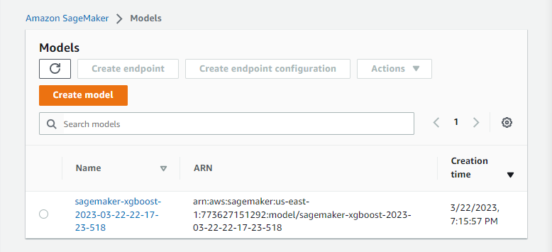

# Cloud-based-Big-Data-Systems-Project: Deploy a trained model to AWS Sagemaker real-time inference end-point
## Goals
* Use a major Big Data system to perform a Data Engineering related task
* Example systems could be:  (AWS Athena, AWS Spark/EMR, AWS Sagemaker, Databricks, Snowflake)

## Progress
 - [x] Configure Amazon SageMaker Studio domain
 - [x] Set up Amazon SageMaker Studio notebook
 - [x] Create realtime inference end-point
 - [x] Build a end-to-end inference pipeline using other models
 - [ ] Create our own model to be deployed on the inference endpoint

### Configure Amazon SageMaker Studio domain
1. Success of cloud stack creation 

2. Success of sagemaker domain creation

3. Steps:

    i. Go to [AWS CloudFormation stack](https://us-east-1.console.aws.amazon.com/cloudformation/home?region=us-east-1#/stacks/quickcreate?templateURL=https://sagemaker-sample-files.s3.amazonaws.com/libraries/sagemaker-user-journey-tutorials/CFN-SM-IM-Lambda-catalog.yaml&stackName=CFN-SM-IM-Lambda-Catalog)

    ii. Acknowledge to create IAM resources

    iii. Create Stack

    iv. Wait until CREATE_COMPLETE

### Set up Amazon Sagemaker Studio notebook
1. Lauch `studio-user` with Studios
2. Create new notebook with `File->New->Notebook`
3. Set up the environment with `Data Science`

### Create Model and Endpoint 

### Inference via the endpoint

## Reference
* [machine-learning-tutorial-deploy-model-to-real-time-inference-endpoint](https://aws.amazon.com/getting-started/hands-on/machine-learning-tutorial-deploy-model-to-real-time-inference-endpoint/?nc1=h_ls)
